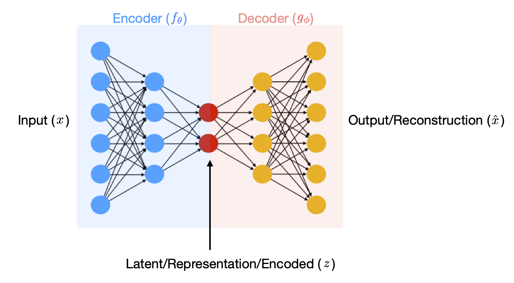
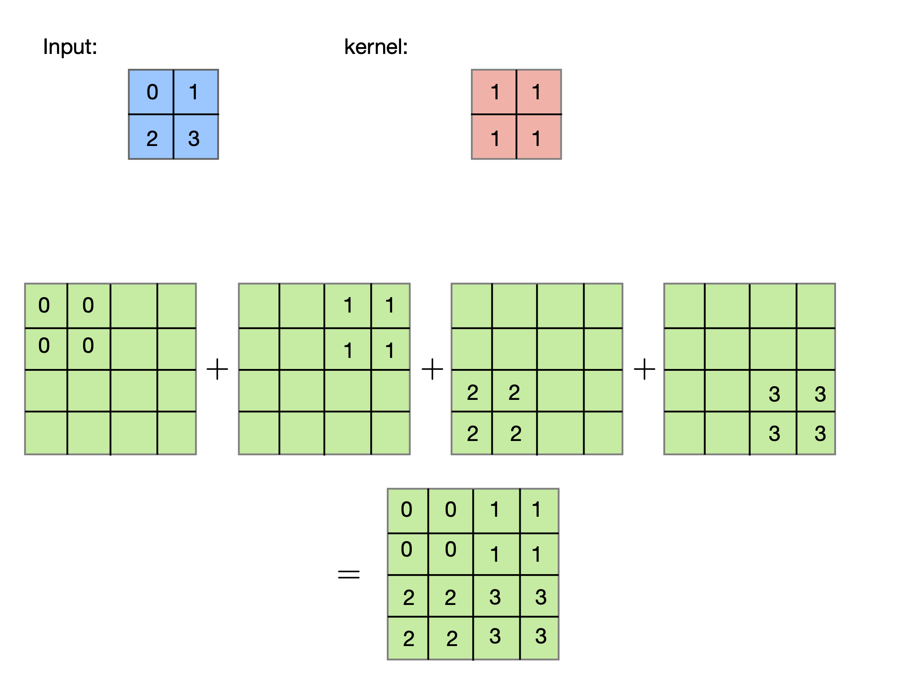
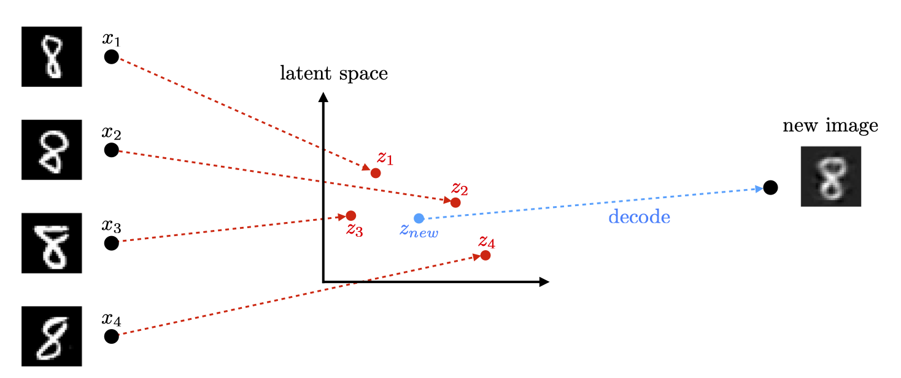

# Autoencoder and Image Generation: Summary

## Introduction to Autoencoder

Autoencoding is a framework that was devised for dimensionality reduction(`unsupervised learning`). This framework is very effective for some applications such as generative modeling. Given a data set $D = \{x_1, \cdots, x_n\}$, the basic idea of autoencoding was to find an encoder mapping $f$ and a decoder mapping $g$ with the following properties. 

- **Encoder ($f$)**:
```math
f: \mathbb{R}^d \rightarrow \mathbb{R}^k
\quad\quad \text{where} \quad k < d \quad \text{sometimes} \quad k \ll d
```
Takes the ''data'' space $\mathbb{R}^d$ into the "latent" space $\mathbb{R}^k$. The intuition here is that the encoder is supposed to provide a succinct representation of the data and hence the resulting latent representation, i.e. $f(x_i)'s$, should have a lower dimension. 

- **Decoder ($g$)**:
```math
f: \mathbb{R}^k \rightarrow \mathbb{R}^d
```
Maps the latent representation back to the data itself. For every data point $x_i$, $z_i = f(x_i)$ is its latent representation(encoded version). Also, $\hat{x}_i = g(z_i) = g \circ f (x_i)$ is the reconstructed(decoded) version of the latent $x_i$.

The mappins $f,g$ are often unknown and we will have to find/learn them using data. This will be done by minimizing the "distortion" in reconstructing the data given as

```math
$$ \sum_{i=1}^n \text{distortion}(x_i, \hat{x}_i) = \sum_{i=1}^n \text{distortion}(x_i, g \circ f(x_i)). $$
```

There are a few options for the distortion metric that are considered in practice (depends on the data and application). Here we use the quadratic distortion(most common), $\text{distortion}(x_i, \hat{x}_i) = ||x_i - \hat{x}_i||_2^2.$ Accordingly, we are aiming to find $f,g$ such that

```math
$$ \displaystyle{\text{minimize}_{f,g \,\, \in  \text{ some class of functions}}} \sum_{i=1}^n || x_i - g \circ f (x_i)||_2^2. $$
```

The problem of dimensionality reduction has been addressed by Principal Component Analysis (PCA) when $f$ and $g$ are linear functions, providing a linear representation of data. However, linear representations often fall short for complex, real-world data.

To capture non-linear patterns, we use deep learning by modeling $f := f_\theta(x)$ and $g := g_\phi(z)$, respectively. This approach allows us to learn non-linear mappings. Our objective then becomes to find the weights $\theta, \phi$ that provide the best fit to the data; i.e.

```math
$$ \text{minimize}_{\theta, \phi}  \sum_{i=1}^n || x_i - g_\phi \circ f_\theta (x_i)||_2^2.$$
```

The weights $\theta, \phi$ will be found by a gradient-descent type algorithm.


## Transposed Convolutions

To process image data in the autoencoder, we use **convolutional layers** `Conv2d()` to encode the images into a reduced-dimensional latent space. The decoder then needs to **upsample** the latent representation back to the original image size. 

For this, we use **transposed convolutional layers** `nn.ConvTranspose2d()`, which reverse the operation of convolutional layers to increase the spatial dimensions of the data. Unlike simple upsampling methods (like interpolation), transposed convolutions learn how to optimally upsample the data through training.

- **Stride**: Controls the upsampling rate. A stride of 2 doubles the spatial dimensions.
- **Kernel Size**: Larger kernels capture broader context, while smaller ones help refine details.
- **Padding** removes rows and columns from the output based on the specified padding size. 
  - For example, if `padding = (1,1)`, it will remove 1 row from the top and bottom, and 1 column from the left and right of the output.
- The critical factor for dimension change(H,W) is the **Stride** and **Padding**, not **Kernel Size**.

Formula for the size of the output: assume that the kernel size is $(k_k, k_w)$ and the input size is $(i_h, i_w)$; also assume that the size of the stride is $s$ and the size of the padding is $p$. Then the size of the output $(o_h, o_w)$ is:

$$o_h = (i_h-1) \times s + k_h - 2p, \text{ and } o_w = (i_w - 1) \times s + k_w - 2p.$$



## Image Generation:

Once the autoencoder has learned to map inputs to a latent space, we can generate new images by **manipulating this latent space**(sampling, interpolation, combinations, adding noise, etc.) 

Specifically, after encoding several images of a particular class (e.g., class "8"), we can take random samples from their latent representations, combine them, and decode the resulting vector to generate a new image that does not exist in the original dataset.




